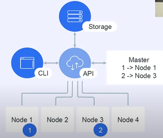

# Kubernetes intro

Source: link:https://www.youtube.com/watch?v=Mw_rEH2pElw&list=PL8D2P0ruohOBSA_CDqJLflJ8FLJNe26K-&index=1[youtube]

### [1.0] K8S Info

#### Зачем нужен кубер?
1. Env variables, хранение secrets(token/password)
2. Автоскейлинг
3. Stateful - приложения сохраняют свои данные (database, cache, etc)
4. healthchecks
5. настройка ресурсов

#### Инструменты разработчика
1. Minikube
2. Kind - кубер в докере
3. Kind - k8s in docker container
4. Ksync
5. Telepresence
6. Skaffold

#### Отладка
1. cubectl-debug
2. cubectl logs/describe

#### Темплейтирование
1. Helm
2. Kustomise

#### Можно быстро поднять окружение под разработку

### [1.1] Схема кубера

