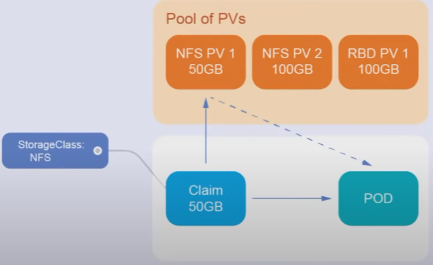
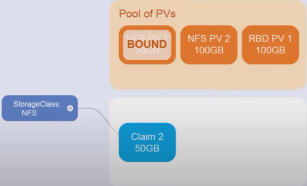
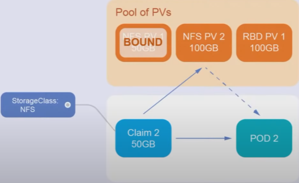
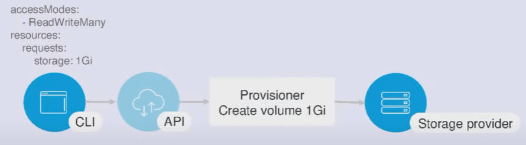

= PV/PVC

Source: link:https://www.youtube.com/watch?v=8Wk1iI8mMrw&list=PL8D2P0ruohOBSA_CDqJLflJ8FLJNe26K-&index=6&t=1655s[youtube] +
PATH: _kuber-learning/src/main/yml/sn12-PV-PVC/..._ +

*Content:*

- 1) PV/PVC intro
  * 1.1) PVC
  * 1.2) Storage class
- 2) Откуда берутся PVC?
- 3) PV Provisioners
- 4) Попытка создать PVC

=== 1) Pv/PVC intro

- _Storage class_: хранит параметры подключения
- _PersistentVolumeClaim_: описывает требования к тому
- _PersistentVolume_: хранит параметры и статус тома

===== 1.1) PVC

В манифесте деплоймента пишем не параметры тома, который мы хотим использовать, а ссылку на него - PVC. А уже PVC описывает параметры диска:
[source, yaml]
----
volumes:
- name: mypd
  persistentVolumeClaim:
    claimName: myclaim
----

Три основных параметра PVC:

- Размер диска - _resources.requests.storage_
- Откуда мы его хотим взять, из какой системы хранения - ссылка на _storageClass_ - _storageClassName_
- Тип доступа к диску - _accessModes_ - (ReadWriteOne, ReadWriteMany, ReadManyWriteOne и т. д.). Либо по одному читают/пишут, либо сразу несколько, либо пишет один, а читают много.

[source, yaml]
----
kind: PersistentVolumeClaim
apiVersion: v1
metadata:
  name: fileshare
spec:
  storageClassName: csi-ceph-hdd-ms1
  accessModes:
  - ReadWriteMany
  resources:
    requests:
      storage: 10Mi
----

===== 1.2) Storage class
Storage class - параметр подключения к системе хранения данных.

Как вообще происходит хранение данных? Сам кубер данных нигде не хранит, для того, чтобы их хранить, нам нужна другая система (Gluster, железо, облако и пр). В Storage class мы описываем, каким вообще образом кубер будет взаимодействовать с другой системой (например, креды). И потом точки монтирования к этой системе будут прокидываться внутрь контейнера.

PVC - это заявка на то, какой диск нам нужен. описывает данные о диске. +
PV - еще одна абстракция, которая создается и в которой записывается инфа о том, какой диск был выдан нашему приложению (там может храниться diskId/address).
StorageClass - куда куберу сходить, т е адрес облака, креды и проч. Кубер идет в это облако, просит у него ресурсы, а потом данные о выданных ресурсах сохраняет в PV. Потом он хочет подключить диск с ID таким-то на узел такой-то ноды. Облако подключает узел на виртуалку и кубернетес прокидывает этот диск через PVC.

=== 2) Откуда берутся PVC?

*Первый вариант:* +
Админ идет в систему хранения данных, создает диски руками, берет id дисков и создает в манифесте PV-ки. При этом при потребности контейнера в PVC-ке (появился контейнер с pvc) в кубернетесе в пуле PV находится наиболее подходящий PV - он объявляется bound - его занимает наш под.

Первый под запрашивает PV размером 50GB

PV размером 50GB становится BOUND

В данном случае при запросе на 50GB из Pool of PVs достанется PV-шка, размер которой НЕ МЕНЕЕ 50GB (может и более, например, 100GB, как у нас во втором случае):

Второй под запрашивает PV размером 50GB - но получает PV размером 100GB

В чем недостатки первого варианта - возможна неудачная нарезка дисков и банальный перерасход памяти. Поэтому обычно пользуются вторым вариантом

*Второй вариант:* использовать _PV Provisioners_

=== 3) PV Provisioners

Для того, чтобы не было перерасхода памяти или такой ситуации, что PV-шек не хватает - в этом случае все новые PVC-ки будут висеть в состоянии Pending - используются PV Provisioners. Provisioner - это небольшая программа, которая умеет ходить в облако и нарезать там диски, создавая из них PV-ки. Провизионер создает диск с таким размером, как требуется PVC-ке.

=== 4) Попытка создать PVC

[source, bash]
----
> kubectl apply -f pvc.yaml
---------------------------------
persistentvolumeclaim/fileshare created

kubectl get pvc
---------------------------------
NAME      STATUS  VOLUME CAPACITY ACCESS MODES STORAGECLASS       AGE
fileshare Pending                              csi-ceph-hdd-ms1   9s

----
Т. к. PV-шек на моем кластере нет, то имеем статус 'Pending'

