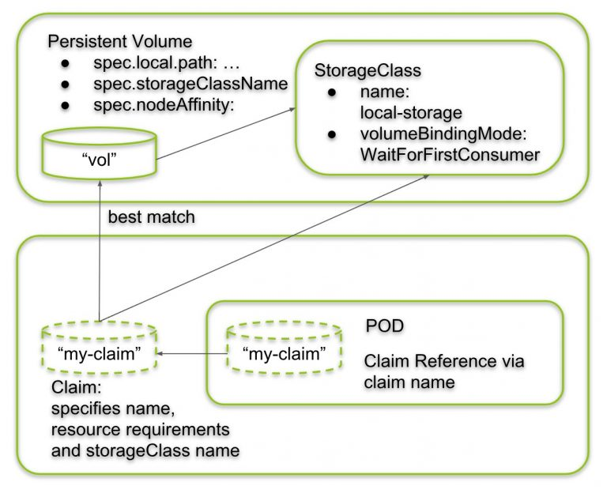
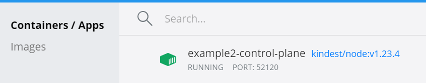
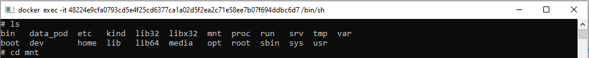

= Local PV/PVC

Source: link:https://vocon-it.com/2018/12/20/kubernetes-local-persistent-volumes/[vocon-it.com] +
PATH: _kuber-learning/src/main/yml/sn13-Local-PV-PVC/..._ +

*Content:*

- 1) Local PV
  * 1.1) Step 1: Create StorageClass with WaitForFirstConsumer Binding Mode
  * 1.2) Step 2: Create Local Persistent Volume
  * 1.3) Step 3: Create a Persistent Volume Claim
  * 1.4) Step 4: Create a POD with local persistent Volume
  * 1.5) Step 5: Add Index File to local Volume and Access Application Data
- 2) LifeCycle of a Local Volume
  * 2.1) Exploring Local Volume Binding after POD Death
  * 2.2) Creating new image pod for existing PV/PVC
- 3) Copying files from and to PV
- 4) Влияние удаления PVC на PV. ReclaimPolicy
- 5) Операция увеличения размера тома (для локальной PV не работает)

=== 1) Local PV

Создадим локальный PV: link:https://vocon-it.com/2018/12/20/kubernetes-local-persistent-volumes/[vocon-it.com]

===== 1.1) Step 1: Create StorageClass with WaitForFirstConsumer Binding Mode

According to the docs, persistent local volumes require to have a binding mode of _WaitForFirstConsumer_. The only way to assign the _volumeBindingMode_ to a persistent volume seems to be to create a _storageClass_ with the respective _volumeBindingMode_ and to assign the storageClass to the persistent volume. Let us start with:
[source, yaml]
----
kind: StorageClass
apiVersion: storage.k8s.io/v1
metadata:
  name: my-local-storage
provisioner: kubernetes.io/no-provisioner
volumeBindingMode: WaitForFirstConsumer
----
Создадим наш storageClass для local PV:
[source, bash]
----
> kubectl create -f storageClass.yaml
---------------------------------
storageclass.storage.k8s.io/my-local-storage created
----

===== 1.2) Step 2: Create Local Persistent Volume

Since the storage class is available now, we can create local persistent volume with a reference to the storage class we have just created:
*_See:_* link:../src/main/yml/sn13-Local-PV-PVC/persistentVolume.yaml[persistentVolume.yaml]

*Note:* `nodeAffinity.required.nodeSelectorTerms.matchExpressions` should contain expresion which match the name of node where PV should be created (in case of kind I have single node named _"example2-control-plane"_). +
You can see all available nodes through the command:
[source, bash]
----
> kubectl get nodes
---------------------------------
NAME                   STATUS ROLES                AGE VERSION
example2-control-plane Ready  control-plane,master 56d v1.23.4
----
Let's create local PV:
[source, bash]
----
> kubectl create -f persistentVolume.yaml
---------------------------------
persistentvolume/my-local-pv created

> kubectl get pv
---------------------------------
NAME        CAPACITY ACCESS MODES RECLAIM POLICY STATUS    CLAIM   STORAGECLASS       REASON   AGE
my-local-pv 50Mi     RWO          Retain         Available         my-local-storage            10s
----
Посмотрим на созданную PV:
[source, bash]
----
> kubectl describe pv my-local-pv
---------------------------------
Name:              my-local-pv
Labels:            <none>
Annotations:       <none>
Finalizers:        [kubernetes.io/pv-protection]
StorageClass:      my-local-storage
Status:            Available
Claim:
Reclaim Policy:    Retain
Access Modes:      RWO
VolumeMode:        Filesystem
Capacity:          50Mi
Node Affinity:
  Required Terms:
    Term 0:        kubernetes.io/hostname in [example2-control-plane]
Message:
Source:
    Type:  LocalVolume (a persistent volume backed by local storage on a node)
    Path:  /mnt/disk/vol1
Events:    <none>
----

===== 1.3) Step 3: Create a Persistent Volume Claim

Similar to hostPath volumes, we now create a persistent volume claim that describes the volume requirements. One of the requirement is that the persistent volume has the volumeBindingMode: WaitForFirstConsumer. We can assure this by referencing the previously created a storageClass (*_See:_* link:../src/main/yml/sn13-Local-PV-PVC/persistentVolumeClaim.yaml[persistentVolumeClaim.yaml]):
[source, yaml]
----
kind: PersistentVolumeClaim
apiVersion: v1
metadata:
  name: my-claim
spec:
  accessModes:
    - ReadWriteOnce
  storageClassName: my-local-storage
  resources:
    requests:
      storage: 10Mi
----
Let's create PVC:
[source, bash]
----
> kubectl create -f persistentVolumeClaim.yaml
---------------------------------
persistentvolumeclaim/my-claim created

> kubectl get pvc
---------------------------------
NAME     STATUS  VOLUME CAPACITY ACCESS MODES STORAGECLASS     AGE
my-claim Pending                              my-local-storage 25s
----
Однако мы видим, что статус у PVC Pending. Более того, если мы гетнем PV-шку, то увидим, что она в статусе Available:
[source, bash]
----
> kubectl get pv
---------------------------------
NAME        CAPACITY STATUS    STORAGECLASS
my-local-pv 50Mi     Available my-local-storage
----
Все дело в строке `volumeBindingMode: WaitForFirstConsumer` в нашем кастомном _storageClass_. Мы можем в этом убедиться, задискрайбив нашу PVC:

[source, bash]
----
> kubectl describe pvc my-claim
---------------------------------
Name:          my-claim
Namespace:     default
StorageClass:  my-local-storage
Status:        Pending
Volume:
Labels:        <none>
Annotations:   <none>
Finalizers:    [kubernetes.io/pvc-protection]
Capacity:
Access Modes:
VolumeMode:    Filesystem
Mounted By:    <none>
Events:
Type    Reason                Age                      From                         Message
----    ------                ----                     ----                         -------
Normal  WaitForFirstConsumer  <invalid> (x4 over 11s)  persistentvolume-controller  waiting for first consumer to be created before binding
----
Итак, "waiting for first consumer to be created before binding". Нам нужен потребитель для этой PVC.

===== 1.4) Step 4: Create a POD with local persistent Volume

The Kubernetes Architects have done a good job in abstracting away the volume technology from the POD. As with other volume technologies, the POD just needs to reference the volume claim. The volume claim, in turn, specifies its resource requirements. One of those is the volumeBindingMode to be WairForFirstCustomer. This is achieved by referencing a storageClass with this property:

Once a POD is created that references the volume claim by name, a "best match" choice is performed under the restriction that the storage class name matches as well. +
*_See:_* link:../src/main/yml/sn13-Local-PV-PVC/http-pod.yaml[http-pod.yaml]

Okay, let us perform the last required step to complete the described picture. The only missing piece is the POD, which we will create now:
[source, bash]
----
> kubectl create -f http-pod.yaml
---------------------------------
pod/www created
----
Теперь посмотрим на PV и PVC - они все имеют статус Bound:
[source, bash]
----
> kubectl get pvc
---------------------------------
NAME     STATUS VOLUME      CAPACITY  ACCESS MODES  STORAGECLASS      AGE
my-claim Bound  my-local-pv 50Mi      RWO           my-local-storage  21m

> kubectl get pv
---------------------------------
NAME        CAPACITY  ACCESS MODES  RECLAIM POLICY  STATUS  CLAIM              STORAGECLASS       REASON   AGE
my-local-pv 50Mi      RWO           Retain          Bound   default/my-claim   my-local-storage            35m
----

===== 1.5) Step 5: Add Index File to local Volume and Access Application Data

Зайдем в консоль контейнера kind, где у нас и развернут кластер:

Создадим там фолдер _/mnt/disk/vol1_ - согласно link:../src/main/yml/sn13-Local-PV-PVC/persistentVolume.yaml[persistenceVolume.yaml] (_spec.local.path_). После чего создадим там файлик _index.html_ и запишем в него "Hello":
[source, bash]
----
# cd mnt
# ls
---------------------------------

# mkdir disk
# ls
---------------------------------
disk

# cd disk
# mkdir vol1
# ls
---------------------------------
vol1

# cd vol1
# ls
---------------------------------

# touch index.html
# ls
---------------------------------
index.html

# vim index.html
---------------------------------
/bin/sh: 38: vim: not found

# echo "Hello" >> index.html
---------------------------------

# cat index.html
---------------------------------
Hello
----

Далее зайдем в под http-pod - просмотрим путь _/usr/share/nginx/html_ (согласно link:../src/main/yml/sn13-Local-PV-PVC/http-pod.yaml[http-pod.yaml] - `volumeMounts.mountPath`) +
Обратите внимание, что в этом поде невозможно выполнить bash:
[source, bash]
----
> kubectl exec -it www -- bash
---------------------------------
error: Internal error occurred: error executing command in container: failed to exec in container: failed to start exec "fa5fdeec3ec1062dad30702ea2b11413c24a125e6989c04b78d9583f80a6538c": OCI runtime exec failed: exec failed: container_linux.go:380: starting container process caused: exec: "bash": execuable file not found in $PATH: unknown
----

Но мы можем выкрутиться через обычный exec:
[source, bash]
----
> kubectl exec -it www -- ls /usr/share/nginx/html
---------------------------------
index.html

> kubectl exec -it www -- cat /usr/share/nginx/html/index.html
---------------------------------
Hello
----
И мы видим записанную нами строку "Hello".

=== 2) LifeCycle of a Local Volume

===== 2.1) Exploring Local Volume Binding after POD Death

Here, we want to explore what happens to an orphaned Kubernetes local volume. For that, we delete a POD with a local volume and observe, whether or not the binding state changes. My guess is, that once a local volume is bound to a persistent volume claim, the binding will persist, even if the corresponding POD has died.

Удалим под и посмотрим на PV/PVC:
[source, bash]
----
kubectl delete pod www
---------------------------------
pod "www" deleted

kubectl get pv
---------------------------------
NAME        CAPACITY ACCESS MODES RECLAIM POLICY STATUS CLAIM            STORAGECLASS     AGE
my-local-pv 50Mi     RWO          Retain         Bound  default/my-claim my-local-storage 12h

kubectl get pvc
---------------------------------
NAME     STATUS VOLUME      CAPACITY ACCESS MODES STORAGECLASS     AGE
my-claim Bound  my-local-pv 50Mi     RWO          my-local-storage 12h
----
То есть и PV-шка, и PVC-шка остались в статусе Bound.

===== 2.2) Creating new image pod for existing PV/PVC

Теперь давайте создадим другой под (другого имеджа), который может подключиться к этой PVшке по ее имени (`claimName: my-claim`). Данный имедж будет каждые 10 секунд читать данные из index.html и выводить их в логи. *_See:_* link:../src/main/yml/sn13-Local-PV-PVC/centos-pod.yaml[centos-pod.yaml]

Давайте создадим этот под:
[source, bash]
----
> kubectl apply -f centos-pod.yaml
---------------------------------
pod/centos created
----
А теперь посмотрим логи в нем:
[source, bash]
----
> kubectl get pod centos
NAME   READY STATUS  RESTARTS AGE
centos 1/1   Running 0        30s

> kubectl logs centos
---------------------------------
Hello
Hello
Hello

> kubectl get pod centos
NAME   READY STATUS  RESTARTS AGE
centos 1/1   Running 0        49s

> kubectl logs centos
---------------------------------
Hello
Hello
Hello
Hello
----
Т е каждые 10 секунд логи пода пополняются новой строкой.

Давайте теперь добавим строчку в index.html. Все в той же консоли контейнера kind, где у нас и развернут кластер:
[source, bash]
----
# cat index.html
---------------------------------
Hello

# echo " World" >> index.html
---------------------------------

# cat index.html
---------------------------------
Hello
 World
----
Гетнем логи пода еще раз:
[source, bash]
----
> kubectl logs centos
---------------------------------
Hello
Hello
Hello
 World
Hello
 World
----
То есть под увидел изменения в PV-шке.

Посмотрим теперь на файл в самом поде:
[source, bash]
----
> kubectl exec -it centos -- bash

[root@centos /]# ls
bin  data  dev  etc  home  lib  lib64  lost+found  media  mnt  opt  proc  product_uuid  root  run  sbin  srv  sys  tmp  usr  var

[root@centos /]# cd data
[root@centos data]# ls
---------------------------------
index.html

[root@centos data]# cat index.html
---------------------------------
Hello
 World
----

=== 3) Copying files from and to PV

Давайте теперь скопируем этот файл из PVки куда-нибудь (в _C:/tmp_):
[source, bash]
----
kubectl cp centos:/data/index.html /tmp/index.html
---------------------------------
tar: Removing leading `/' from member names
----
В файле index.html будет ровно то, что мы записали в него из консоли ноды.

А теперь наоборот, давайте запишем в этот файл что-нибудь другое, например, "Hello from PV", и скопируем файл обратно в под:
[source, bash]
----
kubectl cp /tmp/index.html centos:/data/index.html
----

Просмотрим данный файл из консоли ноды _example2-control-plane_. Мы увидим, что изменилось время модифицирования файла - он был содан 11 числа, и поменялось содержание самого файла:
[source, bash]
----
# ls
---------------------------------
index.html

# ls -lsa
---------------------------------
total 12
4 drwxr-xr-x 2 root root 4096 Jun 12 10:06 .
4 drwxr-xr-x 3 root root 4096 Jun 11 19:39 ..
4 -rw-rw-rw- 1 root root   15 Jun 12 10:06 index.html

# cat index.html
---------------------------------
Hello from PV
----
И если теперь мы опять посмотрим логи, то увидим, что они поменялись:
[source, bash]
----
> kubectl logs centos
---------------------------------
Hello
 World
Hello
 World
Hello from PV
Hello from PV
Hello from PV
----

=== 4) Влияние удаления PVC на PV. ReclaimPolicy

Собственно, удаление поды не удаляет PV/PVC. +
А что произойдет, если мы удалим PVC _my-claim_? Это зависит от политики удаления, в которой мы указываем, что мы хотим делать с нашим диском после удаления PVC. Два варианта:

- оставить как есть
- удалить вместе с PVC

Это описывается в _storageClass_ в секции RECLAIMPOLICY - два варианта - Delete/Retain:
[source, bash]
----
> kubectl get sc
---------------------------------
NAME                 PROVISIONER                    RECLAIMPOLICY   VOLUMEBINDINGMODE      ALLOWVOLUMEEXPANSION   AGE
my-local-storage     kubernetes.io/no-provisioner   Delete          WaitForFirstConsumer   false                  25h
standard (default)   rancher.io/local-path          Delete          WaitForFirstConsumer   false                  58d
----
При удалении PVC, подключенной к _Retain PV_, последняя переходит из статуса *_Bound_* в статус *_Released_*. Диск в этом состоянии существует, но повторно использовать его нельзя. Можно только зайти в хранилище и вытащить оттуда данные. +
Однако, для того, чтобы эту PV можно было переиспользовать, мы можем просто отредактировать yaml-манифест PV, установив там статус *_Available_*. И после этого можно к ней подключать новые PVC-ки.

=== 5) Операция увеличения размера тома (для локальной PV не работает)

Изначально операция, невозможная в принципе. Потом добавили в некоторые провайдеры PV-шек. Потом был создан *_ContainerSearchInterface_*, который позволяет куберу общаться с драйвером провайдера. И этот _ContainerSearchInterface_ как раз и позволил всем провайдерам увеличивать размеры томов. +
*Note:* уменьшить размер диска нельзя. Только увеличить.

Однако операцию увеличения размера диска нельзя провести с local PV. При попытке отредачить `resources.requests.storage` в PVC, выдается ошибка о том, что данный провизионер не поддерживает операцию ресайза:
[source, yaml]
----
kind: PersistentVolumeClaim
spec:
  resources:
    requests:
      storage: 10Mi <- 25Mi
----

[source, bash]
----
kubectl edit pvc my-claim
---------------------------------
error: persistentvolumeclaims "my-claim" could not be patched: persistentvolumeclaims "my-claim" is forbidden: only dynamically provisioned pvc can be resized and the storageclass that provisions the pvc must support resize
----

В целом, если операция ресайза прошла успешно, некоторые провизионеры умеют ресайзить диск без перемонтирования, некоторые провизионеры требуют рестарта пода, для того, чтобы перемонтировать диск увеличенного размера при старте контейнера (mount). Обычно в этом случае в событиях PVC пишется _"Require file system resize of volume on node"_.