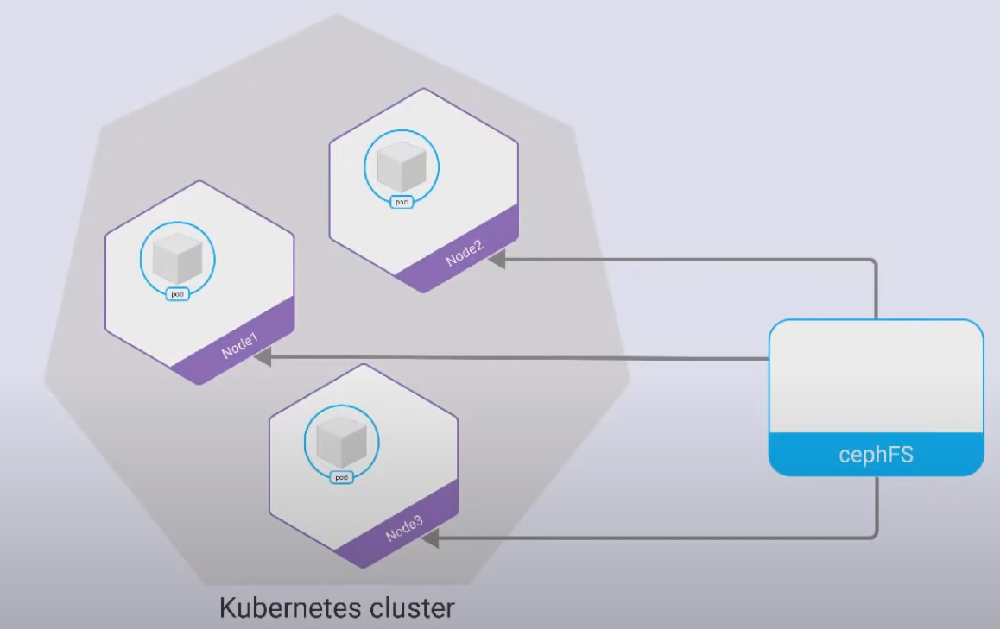
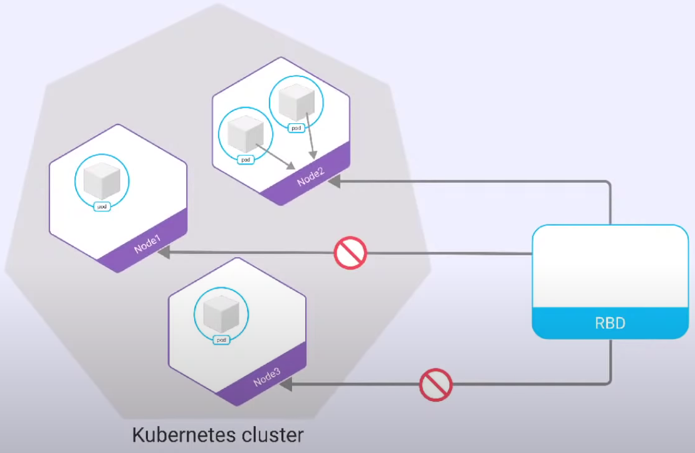

= InitContainers

Source: link:https://www.youtube.com/watch?v=8Wk1iI8mMrw&list=PL8D2P0ruohOBSA_CDqJLflJ8FLJNe26K-&index=8&t=4141s[youtube] +
PATH: _kuber-learning/src/main/yml/sn14-initContainers/..._

*Content:*

- 1) InitContainers intro
  * 1.1) Особенности initContainers
- 2) ReadWriteMany\ReadWriteOnce

=== 1) InitContainers intro

InitContainers - это дополнительный контейнер, который запускается перед запуском основного приложения и делает некоторые дополнительные настройки.
[source, yaml]
----
kind: Deployment
spec:
  template:
    spec:
      initContainers:
      - image: busybox
        name: mount-permissions-fix
        command: ["sh", "-c", "chmod 777 /data"]
        volumeMounts:
        - name: data
          mountPath: /data
      containers:
      - ...
----
Прикольно еще то, что у нас в initContainers может использоваться `volumeMounts`, т е внутрь этого контейнера мы можем монтировать том PV.

Зачем все это нужно? Это потому что конкретно наш _nginx_ работает под пользователем, а не под рутом. Мастер-процесс nginx работает под рутом, а все процессы, обрабатывающие запросы - не под рутом. Соответственно, когда мы по протоколу веб-данных загружаем файлы под nginx, то nginx эти файлы сохраняет под тем юзером, под которым работает процесс, загружающий файлы. А каталог создавался под рутом по умолчанию, и поэтому nginx не сможет туда сохранить файлы. +
Поэтому в initContainers-контейнере мы меняем параметры точки подключения (доступа к каталогу) - вместо "644" ставим туда "777" и теперь любой пользователь может писать в данный каталог. Набор цифр - это тип "разрешенных" действий в данном каталоге в linux - *_See:_* link:https://mexn.ru/prava-dostupa-k-fajlam-v-linux-chto-takoe-chmod-777-i-kak-ego-ispolzovat/[mexn.ru].

=== 1.1) Особенности initContainers

- InitContainers может быть несколько, и тогда они выполняются по порядку описания в манифесте.
- В InitContainers можно монтировать те же тома, что и в основном приложении (например, бэкап БД).
- InitContainers можно запускать от своего пользователя. Например, модно не использовать root, а запускать от своего пользователя, чтобы не испортить чего-нибудь случайно.
- Основное отличие initContainers от обычных - они должны отработать и остановиться. То есть, если у нас три initContainers, то сначала должен запуститься, отработать и успешно остановиться (код выхода) первый initContainer, потом второй, потом третий, и только после этого будет запускаться основное приложение.

Кстати, можно сделать так, что _initContainer_ в _emptyDir_ накидает какой-то инфы, а основной контеинер потом из этого _emptyDir_ чего-нить прочитает.

Если под, у которого несколько initContainers, гетнуть во время создания, то по статусу пода можно понять, какие initContainers уже отработали, какой-работает, а какие - еще не стартовали:
[source, bash]
----
> kubectl get pod
-----------------------------
NAME               READY  STATUS    RESTARTS  AGE
pod-with-5-init-c  0/1    Init:3/5  0         46s
----
В данном примере 2 контейнера из 5 было запущено (сейчас работает 3-й контейнер).

=== 2) ReadWriteMany\ReadWriteOnce

Режим *_ReadWriteMany_* - множество подов могут одновременно читать и писать в PV (например, в кластерную файловую систему *_cephFS_*): +

В случае *_ReadWriteOnce_* "кто первый встал - того и тапки", то есть какой из подов первый забрал себе PVC, тот им и пользуется, остальные поды будут висеть в "_Pending_" или "_Init:0/X_" статусе. +
Но при этом, если в одном поде запущено несколько контейнеров - каждый контейнер спокойно может читать из PV и записывать в нее, потому что они используют одну и ту же точку монтирования (как мы помним, точка монтирования - это внеконтейнерная абстракция, находящаяся на уровне пода). С точки зрения "Kubernetes OS" эти контейнеры по сути два процесса, которые работают под управлением одного ядра. Никаких ухищрений с расшаренным локами не нужно: +

Недавно в кубер был добавлен еще один режим "Стогий ReadWriteOnce". Он запрещает ситуацию с несколькими контейнерами - он запрещает использовать точку монтирования более чем одним контейнером.

