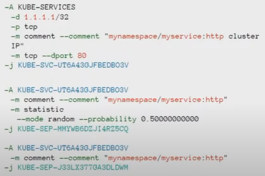
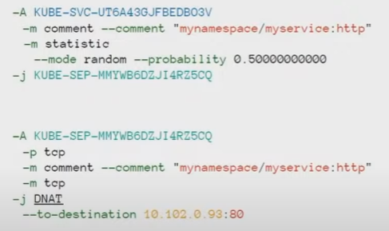
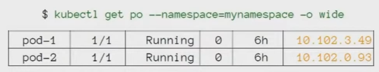
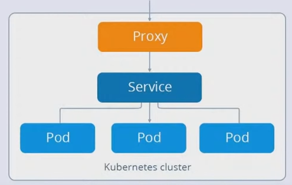
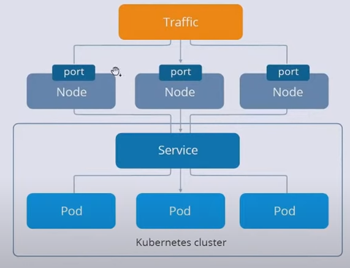
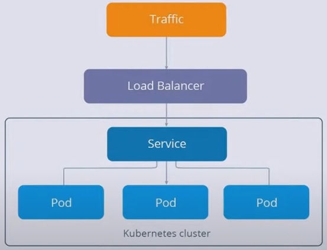
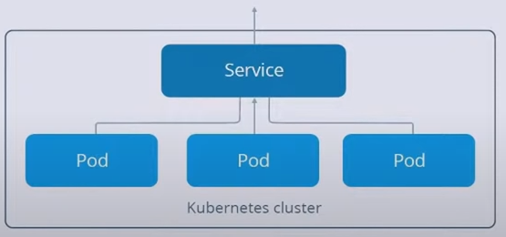

= Service

Source: link:https://www.youtube.com/watch?v=OmTYdf_uDeQ&list=PL8D2P0ruohOBSA_CDqJLflJ8FLJNe26K-&index=11&t=1694s[youtube] +
PATH: _kuber-learning/src/main/yml/sn16-Service/..._ +

*Content:*

- 0) Что такое сервис
- 1) Типы сервисов
  * 1.1) Intro
  * 1.2) ClusterIP
  * 1.3) NodePort
  * 1.4) LoadBalancer
  * 1.5) ExternalName
  * 1.6) ExternalIPs
  * 1.7) Headless
- 2) Практика
  * 2.1) ClusterIP - практика
  * 2.2) NodePort - практика

=== 0) Что такое сервис

Говоря немного абстрактно, сервис - это запись в DNS кубера - see link:https://kubernetes.io/docs/concepts/services-networking/dns-pod-service/[docs kubernetes.io] +
*Note:* записи в DNS кубера имеют тольков сервисы и поды. Есть ip pool для сервисов и ip pool для подов, айпишники в этих пулах не пересекаются.

Если говорить напрямую, то сервис на физическом уровне - это запись в *_iptables_* (link:https://wiki.merionet.ru/servernye-resheniya/14/pogruzhenie-v-iptables-teoriya-i-nastrojka/[link]]) или *_ipvs_* (ip virtual service, link:https://en.wikipedia.org/wiki/IP_Virtual_Server[wiki]]). При настройке кластера можно указать "_backendService_" пропертю - либо iptables, либо ipvs.

Как на самом деле работают сервисы? Рассмотрим наиболее частый случай - использование *_iptables_*. Когда мы создаем service - на всех нодах кластера создаются несколько правил iptables, которые говорят, что трафик, приходящий на ip-адрес сервиса, нужно отправить в некоторую цепочку (queue) iptables. +
Давайте раскрутим эту цепочку - дальше мы увидим, что трафик, попавший в эту цепочку будет отправлен в другую цепочку с вероятностью равную 1/N, где N - количество подов, на которые смотрит сервис. Для двух под вероятность будет 0.5, для четырех - 0.25 и т. д. +

Раскрутим теперь низлежащие цепочки - здесь траффик просто с помощью DNAT команды отправляются на {ip:port} определенного пода. +

У *_ipvs_* все похоже - там точно также создаются определенные правила.

*_Подводя итоги, сервис состоит из_*:

- 1) Статического IP-адреса, который выдается сервису при создании
- 2) DNS имени, ведущего на этот ip-адрес, и строящееся по принципу `my-service-name.my-service-namespace.svc.cluster.local`
- 3) Правил iptables (или ipvs) для роутинга

=== 1) Типы сервисов

Два вопроса о публикации:

- Как вообще свое приложение в кубер кластере "опубликовать", т е сделать так, чтобы клиенты получили к приложению доступ?
- Как настроить межсервисное взаимодействие, между одним и другим сервисом, между фронтом и бэком и пр?

==== 1.1) Intro [[services_types_intro]]

Посмотрим на то, как выглядит типичный сервис (в данном примере - типа _ClusterIP_):
[source, yaml]
----
apiVersion: v1
kind: Service
metadata:
  name: my-service
spec:
  ports:
  - port: 80
    targetPort: 80
  selector:
    app: my-app
  type: ClusterIP
----
*Два ключевых момента для ЛЮБОГО сервиса:*

- 1) selector должен совпадать с лейблами подов, на которые трафик нужно отправлять. Условно говоря, сервис позволяет контролировать трафик и распределять их между подами
- 2) Service и поды должны находиться в одном неймспейсе
  * 2.1) При этом мы можем обратиться к сервису из другого неймспейса и сервис перебалансирует траффик на подах своего неймспейса, которые он контролирует.

==== 1.2) ClusterIP

Это тип сервиса, который используется для отладки и наладки внутрикластерного взаимодействия - фронтенда с бэкендом и пр. через IP-адреса. Каждое пересоздание пода влечет за собой смену ip адреса, и просто задать IP-адрес в переменных окружения не получится, полагаться в целом на поды - неправильно. +
То есть данный тип сервиса в реальных приложениях неприменим. +
Пример: <<services_types_intro>>

Рассмотрим параметры этого сервиса:

- *_port_* - на какой порт данного сервиса будут отправляться запросы от внешних потребителей.
- *_targetPort_* - на какой порт таргетных подов (выбираются по лейблу) данный сервис будет перенаправлять запросы от потребителей.

==== 1.3) NodePort
[source, yaml]
----
apiVersion: v1
kind: Service
metadata:
  name: my-service-np
spec:
  ports:
  - port: 80
    name: http
    targetPort: 80
    protocol: TCP
  selector:
    app: my-app
  type: NodePort
----

С помощью NodePort уже можно опубликовать свое приложение наружу, но с небольшой оговоркой - посмотрим на рисунок: +

На рисунке видно, что на каждой ноде есть порт, и потом трафик идет с них уже на сервис. +
По сути, когда мы создаем NodePort - на каждой ноде нашего кластера (и воркеры, и мастеры) в DNS создастся правило, которое будет транслировать трафик, приходящий на некий порт на ноде, нашему приложению. Это особенный порт - он открывается из особенного диапазона, заранее заданного, в диапазоне портов 30000-32676 (примерно).

Не очень удобно - придется сказать клиентам: "вот, мы теперь работаем на 30000-м порту". И поэтому данный тип сервиса используется преимущественно для двух случаев:

- 1) Если у нас вне кластера есть внешний балансировщик (nginx), общий для всего проекта - тогда мы прямо в балансировщике можем прописывать правила, локейшены и порты, которые надо пробросить в кластер. И тогда в манифесте NodePort можно прописать конкретный порт для ноды. И тогда балансировщик может (какие-то там доп настройки) работать с нодами.
- 2) Служебная функция - NodePort используется при работе сервиса типа LoadBalancer (используется преимущественно в облаках).

==== 1.4) LoadBalancer

[source, yaml]
----
apiVersion: v1
kind: Service
metadata:
  name: my-service-lb
spec:
  ports:
  - port: 80
    targetPort: 80
  selector:
    app: my-app
  loadBalancerIp: "1.1.1.1"
  type: LoadBalancer
----
*_LoadBalancer_* используется преимущественно _в облаках_, потому что у облачных провайдеров есть контроллер (например, OpenStack controller), который смотрит в кубер и контролирует создание сервисов типа _LoadBalancer_. Когда данный тип сервиса создается в кубере, котроллер у себя создает балансировщик (например, _ElasticLoadBalancer_) - и траффик после этого отправляется с балансировщика вовнутрь кластера на наше приложение. Если контроллера нет (нет функциональности, которая может смотреть в апи кубера и контролировать создание сервисов типа LoadBalancer), то _LoadBalancer_ будет бесполезным (в случае не облака (BareMetal)). +
Также _LoadBalancer_ отлично подходит для публикации своих приложений через TCP (надо выставить Postgres/Rabbit вовне кластера), но, опять же, работает только в случае с облаками.

*Параметр _loadBalancerIP_*: +
Более того, в манифесте LoadBalancer можно указать статичный IP-адрес, который будет использоваться как входная точка балансировщика: _loadBalancerIp: "1.1.1.1"_

==== 1.5) ExternalName

[source, yaml]
----
apiVersion: v1
kind: Service
metadata:
  name: my-service-en
spec:
  type: ExternalName
  externalName: example.com
----

Когда мы создаем сервис типа ExternalName, создается правило и создается для него запись. И когда мы из пода обращаемся по имени сервиса (например, _curl my-service-en_), то мы попадает туда, что мы прописал в поле _externalName_ ("example.com"). Это такая "хитрая" переадресация. Кейс придумать достаточно сложно - почему бы не отправить запрос сразу в "example.com" - но такая возможность есть.

==== 1.6) ExternalIPs
[source, yaml]
----
apiVersion: v1
kind: Service
metadata:
  name: my-service-exips
spec:
  ports:
  - port: 80
    name: http
    targetPort: 80
    protocol: TCP
  externalIps:
  - 80.11.12.10
  - 70.60.50.10
  selector:
    app: my-app
  type: NodePort
----

В сервисе типа _ExternalIPs_ почти то же самое, что и у сервисов _NodePort_, только вместо подключения к портам нод мы подключаемся к IPs этих нод. Схема работы _ExternalIPs_ очень похожа на работу _NodePort_ за исключением того, что в _NodePort_ создается правило, которое работает с каким-то портом конкретным, а в _ExternalIPs_ - правило, работающее с определенным IP-адресом. (Вроде как адреса всех нод указываются в списке)

*_Need some additional info_*

==== 1.7) Headless

[source, yaml]
----
apiVersion: v1
kind: Service
metadata:
  name: headless-svc
spec:
  clusterIP: None
  selector:
    app: web
  ports:
    - protocol: TCP
      port: 80
      targetPort: 8080
----

Сервис для работы со *_StatefulSet_*-ами. +
Это сервис, который имеет особое поле `ClusterIP: None`. Это означает, что у этого сервиса не будет создан IP-адрес, но будет создана DNS-запись. И если мы запросим DNS сервиса, то мы получим IP-адреса всех подов, которые стоят за этим сервисом. Более того, мы сможем обращаться к конкретному поду через `<service_name>.<pod_name>`. Используется этот тип сервиса со *_StatefulSet_*. +
В StatefulSet у нас строго определены имена подов, в которых наше приложение будет запускаться. И данные поды будут иметь префиксы - "0", "1", "2"... И таким образом мы сможем настроить репликацию и отправлять запросы на чтение в _slave_, а на запись - в _master_.

Also *_See:_* link:https://blog.knoldus.com/what-is-headless-service-setup-a-service-in-kubernetes/#:~:text=With%20a%20Headless%20Service%2C%20clients,instead%20via%20the%20service%20proxy.[blog.knoldus.com]

=== 2) Практика

==== 2.1) ClusterIP - практика

Создадим деплоймент с configmap:
[source, bash]
----
> kubectl create -f app/
-----------------------------
configmap/my-configmap created
deployment.apps/my-deployment created

> kubectl get pod
-----------------------------
NAME                             READY   STATUS    RESTARTS   AGE
my-deployment-7d6897c54b-7qsr6   1/1     Running   0          2m3s
my-deployment-7d6897c54b-8pzdm   1/1     Running   0          2m3s
----

Итак, мы запустили приложение *_my-deployment_* с nginx. Давайте запустим тестовое приложение, с которого будем обращаться к основному (а потом выйдем из него, потому что нам надо еще запустить сервис):

[source, bash]
----
> kubectl run test --image=centosadmin/utils:0.3 -it bash
-----------------------------
If you don't see a command prompt, try pressing enter.
bash-5.0#

bash-5.0# exit
-----------------------------
Session ended, resume using 'kubectl attach test -c test -i -t' command when the pod is running
----

Создадим *_clusterIp_*:
[source, bash]
----
> kubectl create -f clusterip.yaml
-----------------------------
service/my-service created

> kubectl get svc
-----------------------------
NAME        TYPE       CLUSTER-IP    EXTERNAL-IP  PORT(S)  AGE
kubernetes  ClusterIP  10.96.0.1     <none>       443/TCP  148d
my-service  ClusterIP  10.96.162.98  <none>       80/TCP   39s
----

И увидим, что ему присвоился некоторый ip-адрес, и теперь в DNS-кластере кубера создалась запись, которая по имени сервиса "_my-service_" будет отправлять нас в поды нашего приложения. +
Как это работает? Давайте посмотрим на наш сервис:
[source, bash]
----
> kubectl describe svc my-service
-----------------------------
Name:              my-service
Namespace:         default
Labels:            <none>
Annotations:       <none>
Selector:          app=my-app
Type:              ClusterIP
IP:                10.96.162.98
Port:              <unset>  80/TCP
TargetPort:        80/TCP
Endpoints:         10.244.0.7:80,10.244.0.8:80
Session Affinity:  None
Events:            <none>
----

В данном случае работает селектор `app=my-app`, совпадающий с labels наших подов.

Давайте теперь опять зайдем в наше тестовое приложение и попробуем повзаимодействовать с нашими подами через сервис. +
Для начала попробуем гетнуть поды через сервис по его IP-шнику.
[source, bash]
----
> kubectl exec test -it /bin/bash
-----------------------------
bash-5.0#

bash-5.0# curl 10.96.162.98
-----------------------------
my-deployment-7d6897c54b-7qsr6

bash-5.0# curl 10.96.162.98
-----------------------------
my-deployment-7d6897c54b-7qsr6

bash-5.0# curl 10.96.162.98
-----------------------------
my-deployment-7d6897c54b-8pzdm
----

А потом, как это и надо делать правильно, попробуем гетнуть поды по dns-имени сервиса:
[source, bash]
----
bash-5.0# curl my-service
-----------------------------
my-deployment-7d6897c54b-7qsr6

bash-5.0# curl my-service
-----------------------------
my-deployment-7d6897c54b-8pzdm
----

==== 2.2) NodePort - практика

Создадим сервис NodePort и посмотрим на список сервисов:
[source, bash]
----
> kubectl create -f nodeport.yaml
-----------------------------
service/my-service-np created

> kubectl get svc
-----------------------------
NAME           TYPE       CLUSTER-IP     EXTERNAL-IP  PORT(S)       AGE
kubernetes     ClusterIP  10.96.0.1      <none>       443/TCP       148d
my-service     ClusterIP  10.96.162.98   <none>       80/TCP        26m
my-service-np  NodePort   10.96.107.151  <none>       80:31375/TCP  12s

----

Посмотрим на `PORT - 80:31375/TCP` - этот как раз тот самый порт на ноде нашего кластера в диапазоне 30000-32676. +
Давайте посмотрим на ноды нашего кластера (у нас одна нода):
[source, bash]
----
> kubectl get nodes
-----------------------------
NAME                    STATUS  ROLES                 AGE   VERSION
example2-control-plane  Ready   control-plane,master  148d  v1.23.4

> kubectl get nodes -o wide
-----------------------------
NAME                    STATUS  ROLES                 AGE   VERSION  INTERNAL-IP  EXTERNAL-IP  OS-IMAGE      KERNEL-VERSION
CONTAINER-RUNTIME
example2-control-plane  Ready   control-plane,master  148d  v1.23.4  172.18.0.2   <none>       Ubuntu 21.10  5.10.102.1-microsoft-standard-WSL2
containerd://1.5.10

----

Теперь обратимся к нашему приложению через сервис в самой ноде (через curl) по ip-адресу и по DNS-имени. +
`curl 10.96.107.151:31375` +
Вообще, данная команда должна возвращать данные от приложения, но не возвращает, даже если выполнить это в консоли самого control-plane, пишет +
`curl: (28) Failed to connect to 10.96.107.151 port 31375 after 21044 ms: Timed out`
